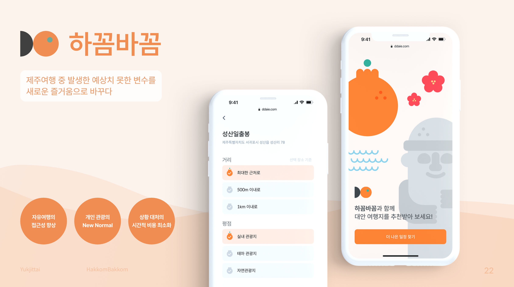
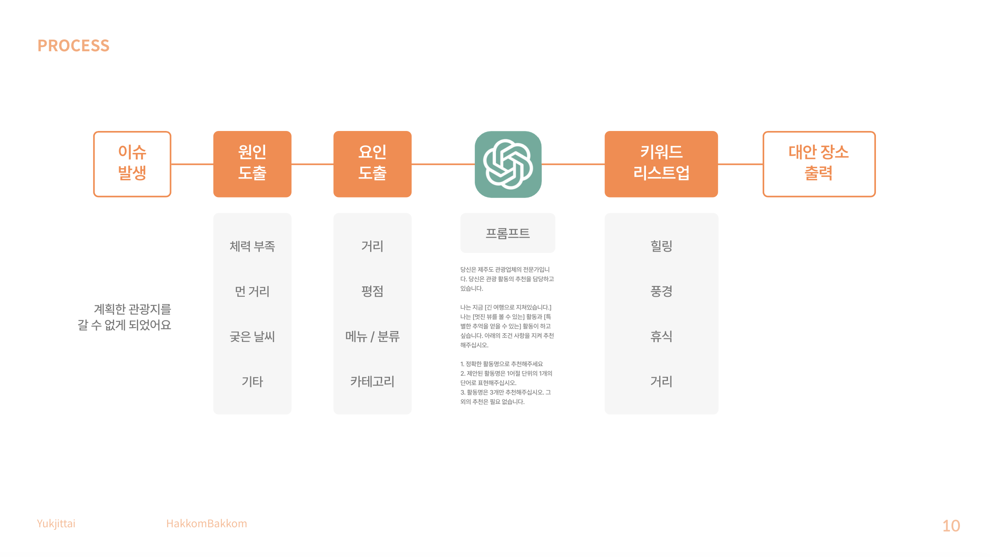
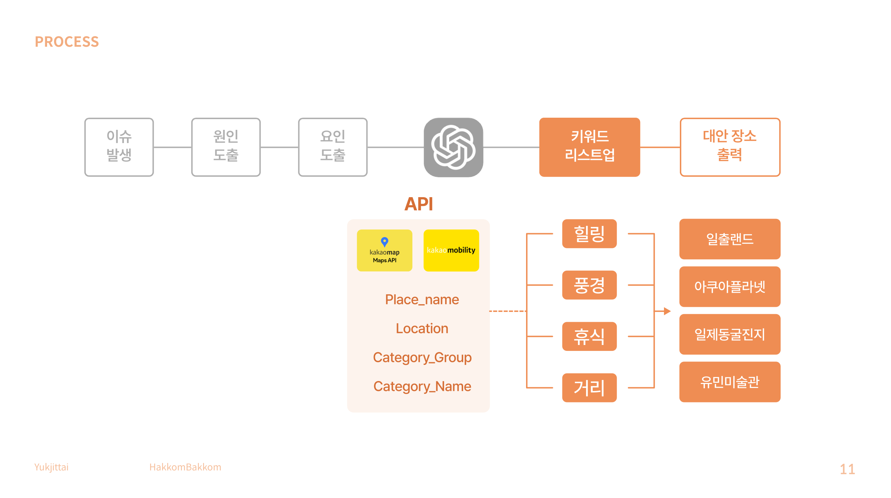
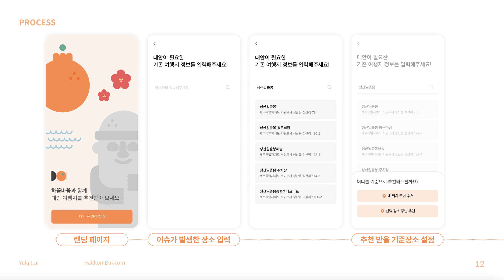
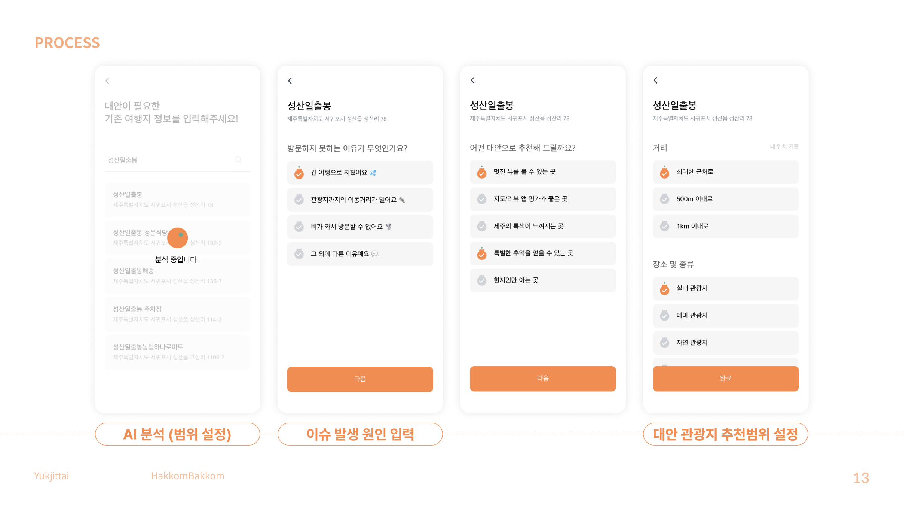
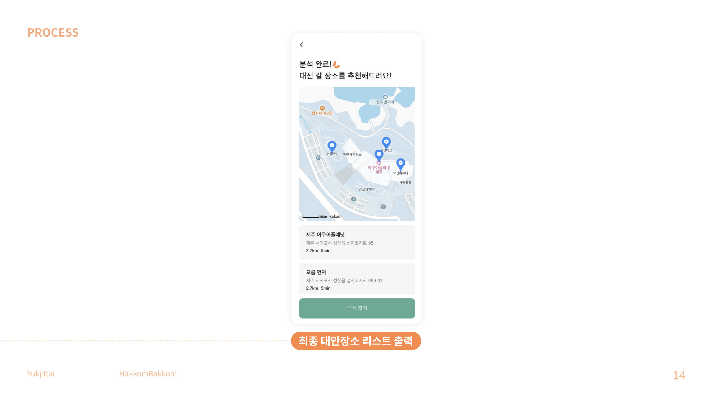

<div align='center'>
    <h1><b>하꼼바꼼🍊</b></h1>
        
        <br/>
		<br/>
		<h3><b>제주여행 중 발생한 예상치 못한 변수를
 새로운 즐거움으로 바꾸다</b></h3>
        <h3><b>🍊 하 꼼 바 꼼 🍊</b></h3>
		<br/>

    프로젝트 기간 : 2023.11.28 - 2023.12.01

<h2>Front</h2>


<h2>Back</h2>

<h2>API</h2>
- 카카오맵 API
<br />
- 카카오 모빌리티 API
<br />
- chatGPT API
<br />


<h2>육지따이 소개</h2>

```
안녕하세요👋
저희는 구름톤 8기 육지따이 입니다.

육지따이는 육지사람들을 뜻하는 제주도 방언으로,
팀원들 모두 육지사람이라서 육지따이로 정했습니다 !!
```

<div align="center">

| [팀장, 기획자] 유선우 | [디자이너] 문민경 | [FE] 백승찬            | [FE] 서주예          | [BE] 김수영 |
| --------------------- | ----------------- | ---------------------- | -------------------- | ----------- |
| 서비스 기획           | UXUI 디자인       | API 기능 구현          | 전체 페이지 개발     | 서버관리    |
| 발표                  | BI 디자인         | 인공지능 API 기능 구현 | 전체 컴포넌트 개발   | 서버 배포   |
| 사업 모델             | 자료 디자인       | 카카오맵 API 개발      | 카카오맵 API 및 화면 |
|                       |

</div>

</div>

> 📑 **프로젝트 자료**

👉 [발표자료](./krampoline/src/assets/file/육지따이_하꼼바꼼.pdf)
<br />
🎨 [디자인 시안](https://www.figma.com/file/rDd8axC30lv0sIknRFIke6/Untitled?type=design&node-id=0%3A1&mode=design&t=pX3sBJ6bKgnJ77H0-1)
<br />

## 📢 **1. 서비스 소개**

제주여행 중 발생한 예상치 못한 변수를 새로운 즐거움으로 바꾸는 서비스 🍊**하꼼바꼼**🍊을 소개합니다!

2021년 제주도 여행객 10명 중 9.6명이 자유 여행객,
<br />
제주도 관광은 국내 자유 여행객이 대부분이며, 개인이 계획하는 자유로운 여행에 대한 니즈가 있습니다.
<br />
<br />
하지만, 제주도에는 환경적인 변수가 많고
<br />
이로인해 한번 틀어진 일정은 이후 여행 일정에까지 영향을 주어, 제주 관광 전체에 차질을 만들어 냅니다.
<br />
<br />
새로운 장소를 찾아내는 공수를 최소화하고, 기존의 목적은 유지한 채, 더 적합한 장소를 추천 받을 순 없을까요?

그래서 준비했습니다!
<br />
<br />
🍊**하꼼바꼼**🍊은 제주도 방언으로 '조금'을 의미하는 [하꼼]과
<br />
'바꾸다'라는 의미의 [바꼼]의 혼합어로
<br />
제주 여행 중에서 생기는 갑작스러운 변수를 조금의 변화로 크게 개선한다를 의미합니다.
<br />
'하꼼바꼼'은 패키지보다 자유여행을 선택한 제주 여행객에게 여행 계획을 수행하는 과정에서의 오류 최소화할 수 있는 좋은 대안이 될 수 있습니다.

## 📢 **2. 프로세스**




## 📢 **3. 화면 구현**




